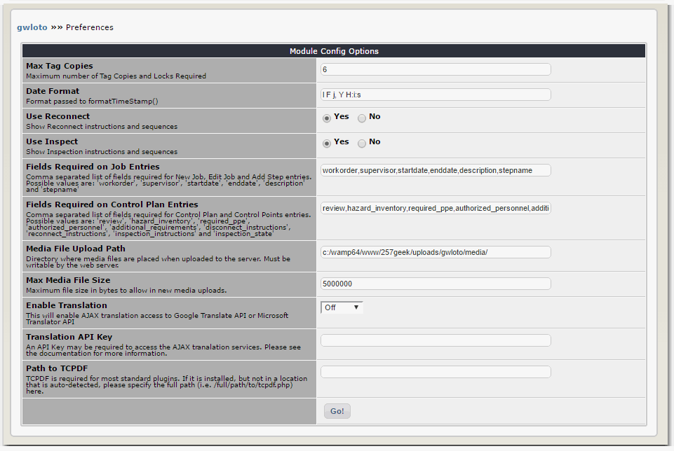

# 3.0 Preferences

The following options are set in the "Preferences" section in the CMS module administration interface.

#### _**Max Tag Copies**_

The number given here is used as the maximum number for the entry of "Tag Copies" and "Locks Required" on control points. The related entry forms feature a drop down list of values ranging from 0 (zero) to the number specified here.

#### _**Date Format**_
This sets the format used to display the last modified dates for gwloto entities. This string is used as an argument for the CMS function formatTimeStamp. This formatting uses standard PHP data and time formats. Documentation of these formats can be found here:
http://www.php.net/manual/en/datetime.formats.php

#### _**Use Reconnect**_
This option can turn off reconnect instructions and sequences system wide. These relate to the re-energizing of equipment, and this is typically considered a controlled procedure, just like the de-energizing.

#### _**Use Inspect**_
This option can turn off inspection instructions and sequences system wide. Conceptually, these relate to the "Try" phase of a "Lock, Tag and Try" policy.

#### _**Fields Required on Job Entries**_
By default, all fields on the New Job, Edit Job and Add Step forms require that an entry be made before the form is processed. This list indicates which fields are required to be entered. You can turn of the data entry requirement for specific fields, by removing it from this comma separated list. Possible values are: 'workorder', 'supervisor', 'startdate', 'enddate', 'description' and 'stepname'.

TIP: Nothing bad happens if a value in this list isn't a valid field name; it will just be quietly ignored. You can use this to simplify turning options on and off, for example, by adding an 'x' to the front of a field name instead of completely removing it.

#### _**Fields Required on Control Plan Entries**_
By default, all fields on the Control Plan and Control Points entry forms require that an entry be made before the form is processed. This list indicates which fields are required to be entered. You can turn of the data entry requirement for specific fields, by removing it from this comma separated list. Possible values are: 'review', 'hazard_inventory', 'required_ppe', 'authorized_personnel', 'additional_requirements', 'disconnect_instructions', 'reconnect_instructions', 'inspection_instructions' and 'inspection_state'

The TIP given in "Fields Required on Job Entries" above applies here, too.

#### _**Media File Upload Path**_
This is the directory where media files are placed when uploaded to the server. It must be writable by the web server. It can be located outside of the web root if desired for security considerations.

#### _**Max Media File Size**_
This sets the maximum file size in bytes that will be allowed in media uploads. The maximum size is also affected by the PHP configuration.

#### _**Enable Google Translation**_
This option only applies if you will be using more than one language. If enabled, users with translate authorities will see an extra "Translate" button when editing places, control plans, control points and media entries. Clicking this button will pass the data currently shown on the form to google.com to be translated into the selected language, using the Google AJAX Language API for Translation. By default this option is off. If you determine that this option will be of benefit to your translators, and you can determine that such use is allowable within your organization (for example, after considering the potential for exposure of sensitive or proprietary information,) you can enable this option here.

For terms and additional information related to the Google AJAX Language API for Translation, see: http://code.google.com/apis/ajaxlanguage/

#### _**Path to TCPDF**_
If TCPDF is installed, but not in a location that is auto-detected, please specify the full path (i.e. /full/path/to/tcpdf.php) here.

